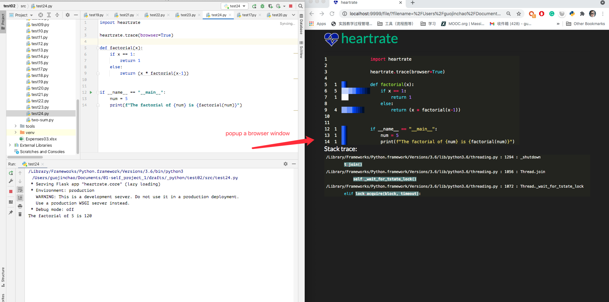
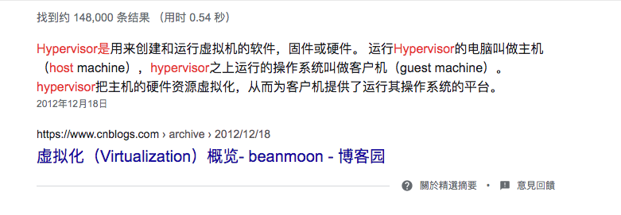
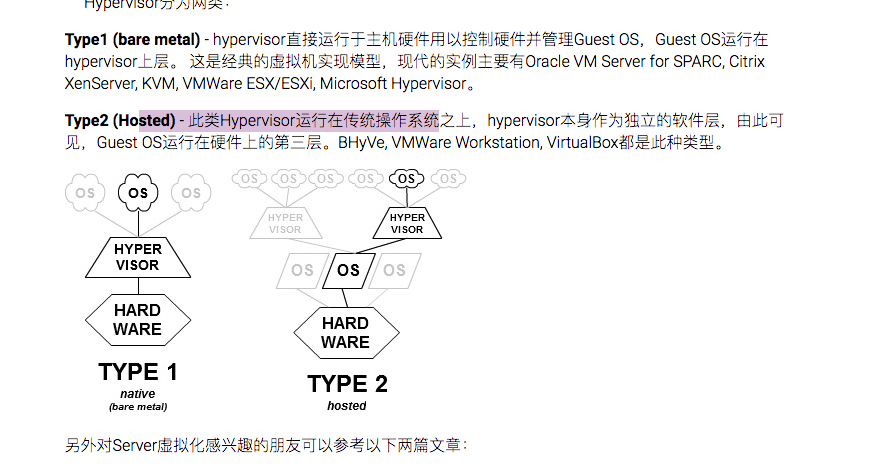
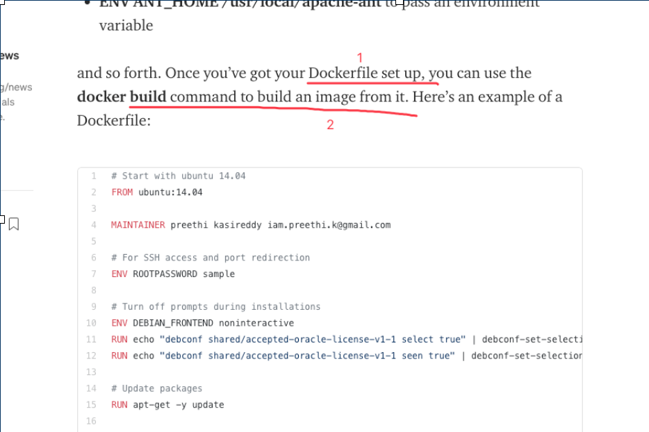
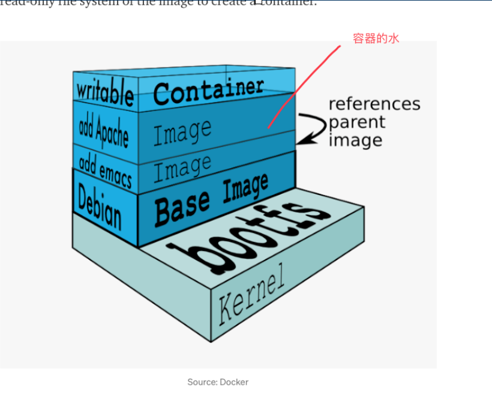

# 2021

| Title                                                        | empty                         | Week    | 序号 |
| ------------------------------------------------------------ | ----------------------------- | ------- | ---- |
| [3 Tools to Track and Visualize the Execution of your Python Code](https://towardsdatascience.com/3-tools-to-track-and-visualize-the-execution-of-your-python-code-666a153e435e) |                               | ✅week19 | 001  |
| [A Beginner-Friendly Introduction to Containers, VMs and Docker](https://medium.com/free-code-camp/a-beginner-friendly-introduction-to-containers-vms-and-docker-79a9e3e119b) | 目前阅读速度：英语母语的 1/12 | ✅week20 | 002  |

## ✅week19(1h 50min)--001

---

### [3 Tools to Track and Visualize the Execution of your Python Code](https://towardsdatascience.com/3-tools-to-track-and-visualize-the-execution-of-your-python-code-666a153e435e)

### overview

1. motivation
   1. optimize error log output format to easy to understande
   2. combinations(p,r)
      1. [api url](https://docs.python.org/3/library/itertools.html)
      2. 排列组合
      3. `combinations([2,1,0], 2)` returns `[(2, 1), (2, 0), (1, 0)]` .

### Tools

#### 1. Loguru — Print Better Exceptions - accurate positioning

> pip3 install loguru

- use in main function by annotation
  - `@logger.catch`

#### 2. snoop - help you understanding proj more clearly

> pip3 install snoop

#### 3. heartrate - Visualize the Execution of a Python Program in Real-Tim

> pip3 install heartrate

`The longer bars mean more hits`

`lighter colors mean more recent`

### conclution

Awesome tools for debugging!

## ✅week20(1h 50min)--002

[A Beginner-Friendly Introduction to Containers, VMs and Docker](https://medium.com/free-code-camp/a-beginner-friendly-introduction-to-containers-vms-and-docker-79a9e3e119b)

- references
  - [什么是Hypervisor?](https://www.dell.com/community/%E5%85%A5%E9%97%A8%E7%BA%A7%E5%92%8C%E4%B8%AD%E7%AB%AF/%E5%88%86%E4%BA%AB-%E4%BB%80%E4%B9%88%E6%98%AFHypervisor/td-p/6904385)

**conclusion**

文章主要阐述了 虚拟机 和 docker 容器 的运行机制，以及原理上的不同，还有各自的优势劣势，讲的非常清晰明了，有需要的同学可以好好看一看，对以后使用 docker 一定也有更好的认识和深入。